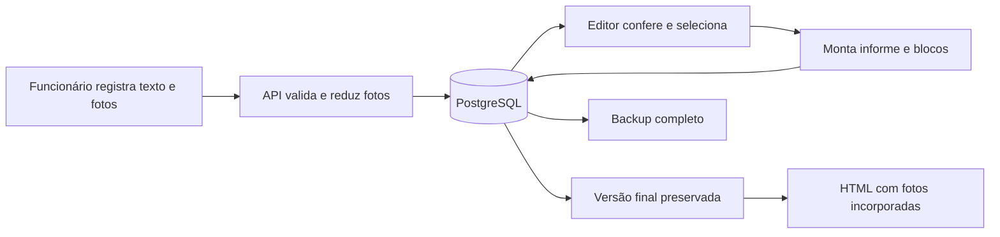

# Sistema-Gestão-Comunicação-Condomínio

Aplicação editorial com API Flask e **PostgreSQL 17**, independente do sistema antigo. Acesso: http://localhost:9001.

**0.2.1-beta.1 — Beta local.** Editor TinyMCE unificado; autenticação e aprovação por usuário ainda em planejamento. Veja [o plano da Beta](../docs/beta-autenticacao-e-aprovacao.md) e a página `/beta.html` no sistema. Notas soltas usam o mesmo acervo de registros, com categoria própria.

Revisão por IA integrada ao editor: botão **Revisar com IA**, comparação de sugestões e aplicação seletiva, sem salvar automaticamente. Usa GPT-OSS 120B na GroqCloud e requer chave da conta Free. Execute `configurar-ia.ps1` para configurar a chave em entrada oculta; o recurso permanece desativado até isso ocorrer. Veja [autorização e IA](../docs/autorizacao-condominio-e-ia.md). Em nova instalação sem IA, crie `.secrets/groq_api_key` vazio antes do Compose.

## Usar e importar os dados anteriores

Crie registros com texto e fotos, confira as informações, selecione os registros para cada informe, organize os blocos no editor TinyMCE e finalize uma cópia. O HTML exportado incorpora as fotos; o PDF continua disponível pela impressão do navegador.

O salvamento agora ocorre no servidor, e outros navegadores acessam o mesmo acervo. Recarregue a página para buscar alterações de outra sessão. Gravações concorrentes são bloqueadas para evitar sobrescrita; o aviso permite baixar o rascunho JSON, tentar novamente ou recarregar. Um rascunho baixado pode ser importado como novos documentos.

Para trazer os dados anteriores, abra **o mesmo navegador e endereço** usados antes e clique em **Importar deste navegador**. A importação acrescenta os documentos, remapeia identificadores e preserva os vínculos entre fontes e matérias. Repetir a mesma importação não duplica os documentos. Os originais locais não são apagados.

localhost e 127.0.0.1 mantinham acervos locais separados; importe a partir de cada origem utilizada. A nova versão usa o mesmo PostgreSQL em ambos os endereços.

## Organização do banco

| Tabela | Conteúdo |
|---|---|
| records | Um documento JSONB por registro, incluindo referências às fotos |
| editions | Um documento JSONB por informe em edição, com blocos e fontes |
| publications | Cópias finalizadas, que a API impede de alterar ou excluir |
| media | Fotos binárias identificadas pelo SHA-256, dimensões e formato |
| change_history | Antes/depois dos documentos alterados, com data |
| workspace_state | Revisão global para detectar gravações concorrentes |
| browser_imports | Importações já concluídas |
| schema_versions | Versões do esquema |

Os campos editoriais variáveis usam JSONB em documentos separados por entidade. Há índices para situação/data dos registros e período dos informes. Cada gravação é transacional: fotos, documentos e histórico entram juntos ou são revertidos. As fotos são referenciadas por URL e não repetidas em base64 nos documentos.

O histórico existe no banco; ainda não há tela de consulta/restauração de revisões. A correção de informe finalizado cria outra edição. Nesta etapa, a API carrega o acervo completo; acervos muito grandes exigirão paginação e gravação por documento.

## Fotos e editor

- TinyMCE 8.9.1, instalado localmente, com português, fontes, cores, alinhamento, espaçamento, recuos, tabelas, busca/substituição, contagem de palavras, tela cheia e Ctrl+S. Aplicado a todos os campos de texto longo: notas, registros, informes e pedidos de complemento. Títulos, legendas, datas e identificadores permanecem campos simples adequados ao seu uso. Licenças em [THIRD-PARTY.md](THIRD-PARTY.md).
- Os registros conservam `text` simples para compatibilidade e `textHtml` formatado. O HTML passa por sanitização no navegador e no servidor e acompanha a matéria do informe. Textos antigos não são reinterpretados como HTML.
- Redução real no navegador e no servidor. Orientação EXIF respeitada; encaixe proporcional em **200×355** (vertical) ou **355×200** (horizontal), sem corte e sem ampliar fotos pequenas.
- Compressão WebP ou PNG. Arquivos já otimizados em PNG/WebP, sem metadados EXIF/ICC, são preservados para evitar recompressão.
- Fotos idênticas compartilham um arquivo no banco. O original de alta resolução não é retido; conserve-o separadamente.
- Exportação HTML autocontida com fotos compactas.

## Docker e persistência

Execute no diretório da aplicação: `docker compose up -d --build --wait`. Nesta máquina o Docker está acessível pelo WSL Ubuntu:

```powershell
wsl -d Ubuntu -- docker compose -f /mnt/d/01_Claude-Desktop/02_Projeto-Relatorio-SQA/prototipo-condominio/compose.yaml up -d --build --wait
```

O volume `sistema-gestao-comunicacao-condominio_postgres_data` sobrevive à recriação dos contêineres. **Não use `down -v`**, pois remove o volume.

A senha aleatória fica em `.secrets/postgres_password`, ignorada pelo Git e pelo build, montada como segredo. Conserve esse arquivo ao mover a instalação. Em instalação nova, gere uma senha aleatória nesse caminho antes de iniciar. Não troque somente esse arquivo em banco já inicializado: a senha também precisa ser alterada no PostgreSQL.

O PostgreSQL não publica porta no computador; a aplicação usa 127.0.0.1:9001. Os perfis continuam demonstrativos, **sem login e controle de permissões**. Acesso pela rede e autenticação precisam ser implementados antes do uso por funcionários em dispositivos diferentes. Não há edição offline ou publicação automática na internet.

## Backup

Na pasta raiz do projeto:

```powershell
powershell -ExecutionPolicy Bypass -File prototipo-condominio/backup.ps1
```

O script gera um `pg_dump` completo em formato customizado na pasta `backups`, incluindo fotos e histórico. Não há agendamento automático. Copie os backups para outro local para proteção contra perda do computador.

Para restaurar, crie um banco vazio separado com `createdb`, copie o arquivo para o contêiner com `docker cp` e execute `pg_restore -U condominio --exit-on-error -d NOME_DO_BANCO_VAZIO ARQUIVO.dump`. Confira o resultado antes de apontar a aplicação para esse banco. Não restaure sobre o acervo em uso.

## Verificação

- `qa/database.py`: PostgreSQL real em banco temporário; persistência, inicialização repetida, fotos, conflitos, publicações imutáveis, importação idempotente, reversão e histórico.
- `qa/editorial.cjs`: editor, formatação após recarga, blocos, dimensões das fotos, impressão, layout móvel e exportação.
- `qa/shared-storage.cjs`: sessões independentes, conflito e importação do IndexedDB.
- `qa/beta-editor.cjs`: nota solta formatada, comandos do editor, Ctrl+S, validação de texto vazio, reabertura, conteúdo levado ao informe, pedido de complemento e área de escrita acessível no celular.

Os testes de navegador exigem `QA_URL` na porta **19001**, com banco descartável, e `PLAYWRIGHT_MODULE` apontando para o módulo instalado. Não execute testes de escrita contra o acervo real.


